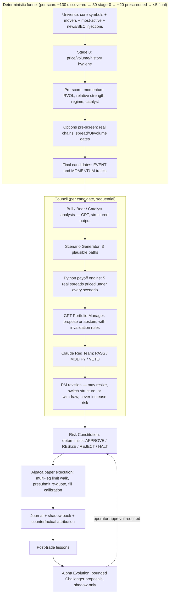
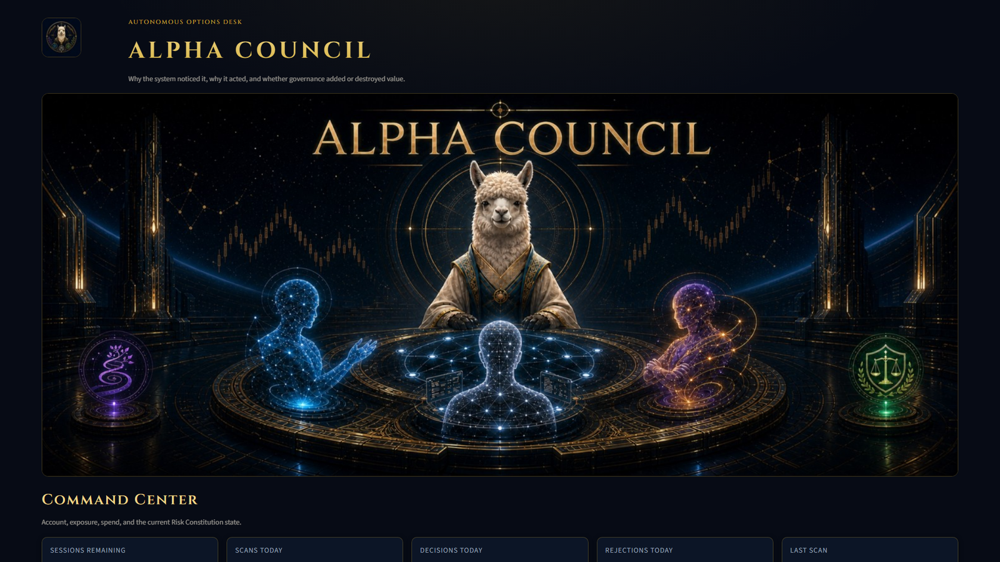
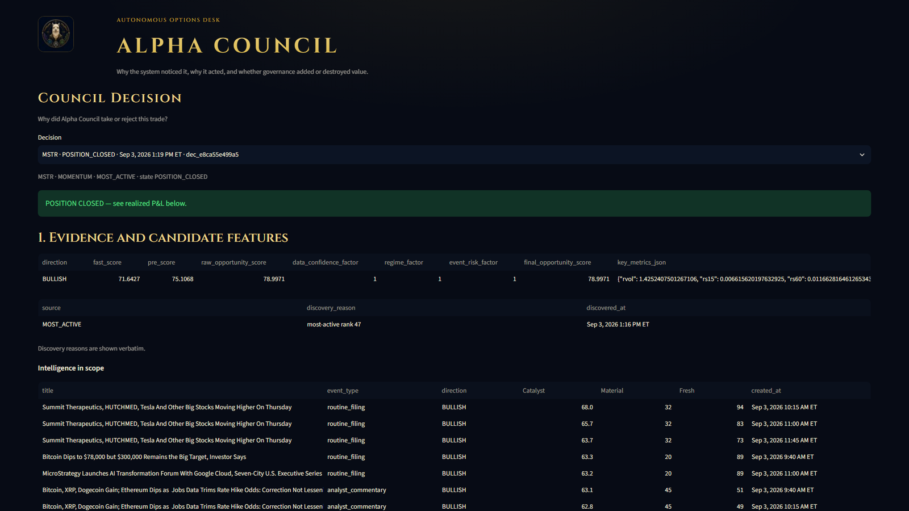
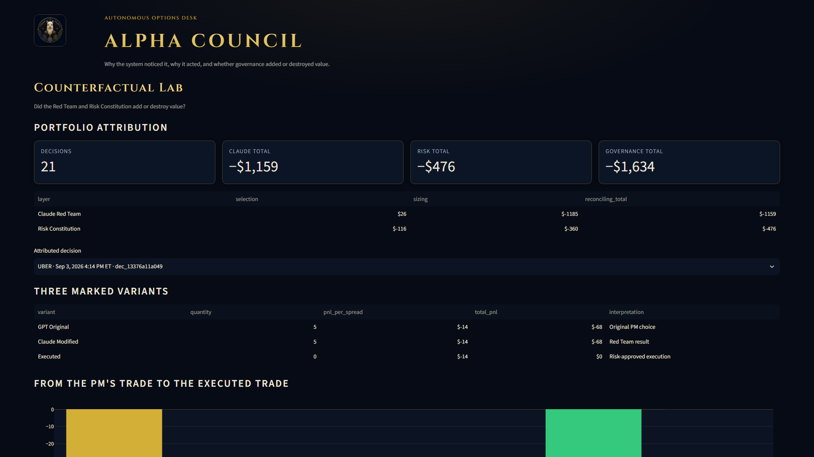
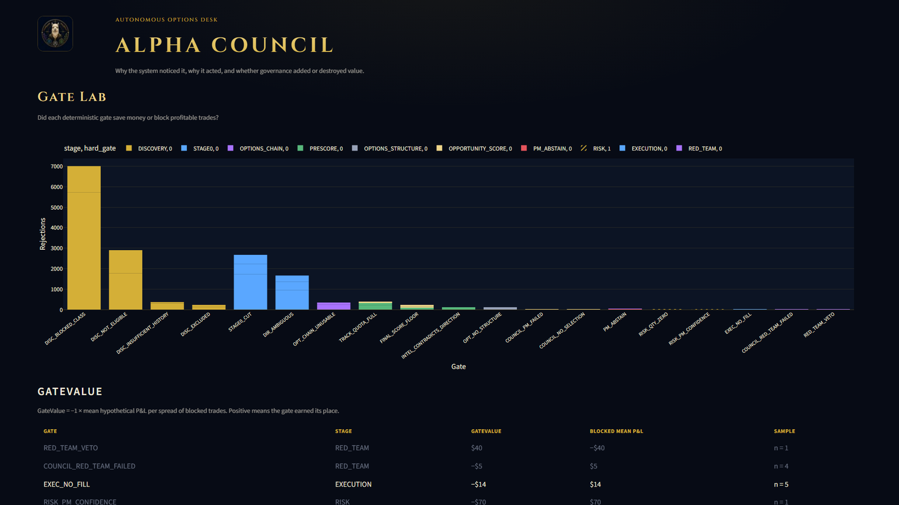
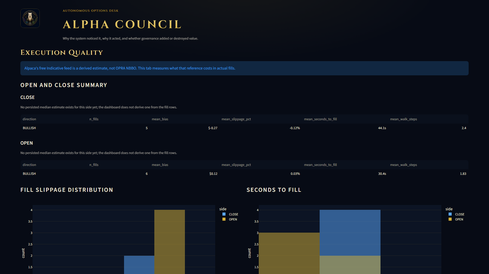
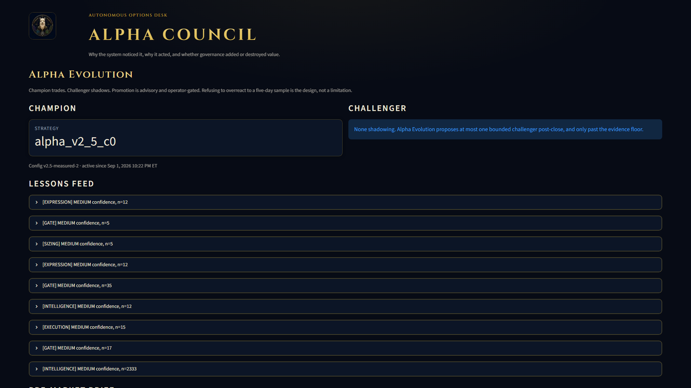

# Alpha Council

**An autonomous, options-native trading desk that debates its trades, measures whether its own reasoning added value, and refuses to trust itself without evidence.**

Built for the Alpaca AI Trading Agents Hackathon. Paper trading only, enforced in code.

> Most AI trading agents tell you why they made a trade. Alpha Council shows how it found the opportunity, measures whether each decision layer added value, and proves what its risk gates saved or cost — including on trades it refused to take.

---

## The four layers

| Layer | One line |
|---|---|
| **Alpha Council** | Generates and debates trades: quant funnel → analyst agents → scenario payoffs → a GPT portfolio manager. |
| **Alpha Constitution** | A deterministic risk constitution that AI cannot override: hard gates on size, sector, drawdown, liquidity, and time. |
| **Counterfactual Lab** | Records what GPT originally wanted, what Claude changed, and what executed — then attributes P&L to each layer (selection vs sizing). |
| **Alpha Evolution** | Uses those measured outcomes to propose a bounded Challenger strategy that must beat the Champion *in shadow* before an operator may promote it. |

The differentiator is the measurement loop: **Counterfactual Decision Attribution + Gate Attribution + Champion/Challenger evolution**. Every rejected candidate gets a shadow record, so the system can later say what its gates saved or cost. Every executed trade gets three P&L variants (GPT-original, Claude-modified, executed), so "did the Red Team help?" is a number, not a vibe.

## Architecture



**Deterministic decides, AI proposes.** The funnel, payoff math, risk constitution, order walk, and every gate are plain Python with pinned thresholds in config. The LLMs only ever produce structured, schema-validated *proposals* inside that frame:

| Role | Model | Output |
|---|---|---|
| Bull / Bear / Catalyst analysts | GPT (gpt-5.6) | Structured evidence, no free text into decisions |
| Scenario Generator | GPT (gpt-5.6-sol) | 3 bounded price paths with probabilities |
| Portfolio Manager | GPT (gpt-5.6-sol) | Trade/abstain + thesis + invalidation rules + structure rank |
| Red Team | Claude (claude-sonnet-5) | PASS/MODIFY/VETO + risk score + confidence adjustment |
| Lessons / Evolution | GPT (gpt-5.6-sol) | Evidence-for/against lessons; bounded Challenger configs |

## What actually happened across the two live sessions (2026-09-02 → 09-03)

We publish the real numbers because the honest ones are the interesting ones:

- **55 councils** convened over two sessions; **24 Portfolio Manager trade proposals**, the rest reasoned abstains with the objection named.
- The Claude Red Team completed **19 reviews: 18 MODIFY, 1 VETO**, with real critiques ("catalyst-free momentum trade whose own scenario table loses in STALL and reaches max loss in REVERSAL"). Mean confidence adjustment −0.14; every MODIFY capped risk below the PM's ask.
- **Day one: zero alpha trades.** On a catalyst-thin tape PMs withdrew on revision, and the Constitution rejected the one survivor (IREN) at *PM confidence 0.51 below the tier floor 0.52*. One point short, and the floor held.
- **Day two: four council-approved alpha trades, all journaled end to end** — BMNR ×2, MSTR ×1, CLSK ×3, JNJ ×1 — after two operator decisions made on the record that morning: continuation-conviction setups may proceed at *reduced* size rather than die to stall exposure, and a reduction floors at **one spread** instead of rounding to zero (two fully approved trades had been vetoed by granularity alone). The Constitution still rejected an MSTR add-on against an already crypto-heavy book, and the Red Team issued its first VETO.
- **Realized P&L: −$251** across five journaled lifecycles (BMNR +$12, MSTR +$10, CLSK −$72, JNJ −$192, calibration −$9). Part of the two losses is spread-crossing cost from the forced 15:45 competition flatten, not adverse movement. Fill calibration across 11 measured fills: mean bias **−$0.06** vs the indicative-adjusted mid.
- Alpha Evolution ran two post-close cycles (50 and 77 decisions reviewed, 9 lessons) and **declined to propose a Challenger both times** — the second time naming the confound: "numerous configuration/tier versions were active during the period." A learning loop that can tell a small sample from a contaminated one is the system working.
- Total GenAI spend for the whole competition: **$7.74 of $100** (392 OpenAI calls, 21 Anthropic calls). 15,982 gate rejections across 948 symbols were decided by arithmetic, not models.

## The dashboard, on the real rows

Captured after the final session (2026-09-03), dark council theme.

**Command Center** — account, exposure, spend, and the Constitution's state.



**Council Decision** — the MSTR lifecycle: evidence, three analysts, the PM's thesis and invalidation rules, Claude's MODIFY, the revision at reduced size, the Constitution's sizing, and the fill.



**Counterfactual Lab** — three marked variants per decision and the selection-vs-sizing attribution per governance layer.



**Gate Lab** — what every deterministic gate rejected, and what those refusals were worth.



**Execution Quality** and **Alpha Evolution** — limit-walk behavior and measured fill bias; lessons with evidence for and against, and the promotion gate that stays closed.





## Market-data honesty (IEX + Indicative)

Alpha Council runs on Alpaca's free feeds and treats their limits as *measured engineering inputs*, not fine print:

- **Equities: IEX.** RVOL is computed same-feed and same-clock-window against prior sessions, with a previous-window fallback at window boundaries — never cross-feed, never fabricated.
- **Options: the Indicative feed.** Quotes are derived, so the engine timestamps every leg, applies a staleness buffer and an indicative-spread adjustment to mids, and re-quotes both legs immediately before submission (a §17.4 presubmit refresh) with per-leg spread gates.
- **Open interest is absent from Indicative snapshots** (measured live: 12,746 contracts, zero OI fields). OI gates are fed from the Trading API's contracts endpoint instead, cached 15 minutes; if that endpoint is down the OI gate stands down loudly rather than pretend.
- **Fill calibration.** Every fill records expected-vs-actual on both the open and close side, and the measured bias feeds back into limit pricing.

## MCP

Alpaca's MCP server is Alpha Council's control plane: account state, the market clock, and positions are served over MCP, with the measured MCP share of control-plane calls reported in the Audit tab. Order execution deliberately uses Alpaca's REST API directly, because the idempotent submit-verify-recover semantics around each `client_order_id` are load-bearing safety behavior we were not willing to route through a second transport during competition week.

## Safety posture

- **Paper-only, enforced:** every entry point calls `assert_paper_only()`; the process refuses to start against a live account.
- **Hard gates never move at runtime:** per-trade risk, open-portfolio risk, sector caps, drawdown halts, liquidity floors, DTE bounds, and the new-trade cutoff live in `config/risk_constitution.yaml` and bind even for calibration trades.
- **The Red Team is a brake, not an engine:** a revision may never increase requested risk.
- **Evolution is shadow-only:** `promote()` raises without explicit `operator_approved=True`; Challenger configs can only touch a whitelisted set of quality parameters within bounded ranges, validated by `change_validator`.
- Secrets stay in `.env` (gitignored); the database and logs are untracked.

## Running it

Requirements: Python ≥ 3.11, [uv](https://docs.astral.sh/uv/), an Alpaca **paper** account, OpenAI + Anthropic API keys.

```bash
cp .env.example .env        # fill in keys; ALPACA_PAPER_TRADE stays true
uv sync
uv run python -m pytest -q  # 526 tests
```

Run the desk (scheduler drives the full trading day — scans, councils, monitor, flatten, post-close evolution):

```bash
uv run python scripts/run_alpha_council.py --max-trades 10
```

Dashboard (dark/light themed, 9 tabs: Command Center, Discovery Funnel, Scanner, Council Decision, Counterfactual Lab, Gate Lab, Execution Quality, Alpha Evolution, Audit):

```bash
uv run streamlit run dashboard/app.py
```

Any tab can be addressed directly for screenshots or recording with `?tab=<slug>` (label lower-cased, spaces as underscores — e.g. `http://localhost:8501/?tab=counterfactual_lab`), which renders that view without the tab strip.

Operational scripts:

```bash
uv run python scripts/calibration_trade.py --execute   # one journaled 1-lot lifecycle (dry-run without --execute)
uv run python scripts/close_all.py --execute           # standalone flatten: journaled closes + orphan sweep, exits non-zero if not flat
uv run python scripts/discover_once.py                 # single discovery/funnel pass, no orders
uv run python scripts/council_once.py                  # one council end-to-end against a live candidate, no orders
```

## Repository layout

```
alpha_council/
  quant/          discovery, scoring, funnel scanner
  intelligence/   Alpaca news + SEC EDGAR collectors (rate-limited, deduped, fail-open)
  agents/         LLM clients, evidence builder, council, scenario generator, red team, evolution
  options_engine/ chain fetch, OI enrichment, spread builder, payoff engine
  risk/           the Risk Constitution
  execution/      order manager, limit walk, presubmit refresh, position monitor
  journal/        trade journal, shadow book, counterfactual attribution
  evolution/      champion registry, change validator, shadow runner, promotion
  scheduler.py    the trading day
config/           scoring.yaml, risk_constitution.yaml, event_calendar.yaml, universe.yaml
dashboard/        Streamlit app + theme
scripts/          run_alpha_council.py, calibration_trade.py, close_all.py, ...
tests/            526 tests
```

## Honest framing

The calibration and evolution loop is presented as **instrumentation that would enable learning at scale; the competition run is its first, deliberately small sample.** With tens of decisions, refitting weights would be noise-chasing — so the system records the counterfactuals, generates falsifiable lessons with evidence on both sides, and lets the Challenger mechanism wait for a sample worth acting on. Alpha Council does not just explain its trades. It measures whether its own reasoning helped, learns from those measurements, and tests better versions of itself before trusting them with capital.

## Documents

- `Alpha_Council_v2_4_Implementation_Specification.md` — the governing spec (funnel, council, constitution, execution)
- `Alpha_Council_v2_5_Alpha_Evolution_Implementation_Addendum.md` — the learning layer
- `SUBMISSION_WRITEUP.md` — the build mapped to the four judging criteria, with the live numbers
- `docs/SUBMISSION_FORM.md` — the submission summary
